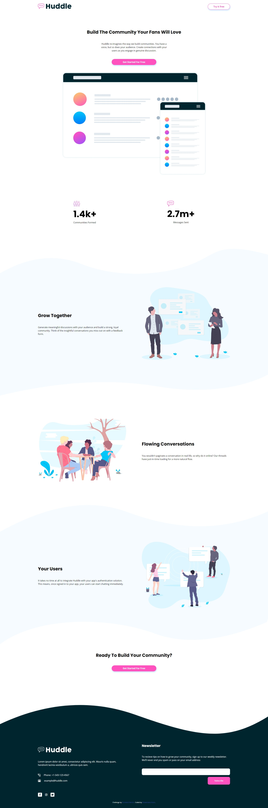

# Frontend Mentor - Huddle landing page with curved sections solution

This is a solution to the [Huddle landing page with curved sections challenge on Frontend Mentor](https://www.frontendmentor.io/challenges/huddle-landing-page-with-curved-sections-5ca5ecd01e82137ec91a50f2). Frontend Mentor challenges help you improve your coding skills by building realistic projects. 

## Table of contents

- [Overview](#overview)
  - [The challenge](#the-challenge)
  - [Screenshot](#screenshot)
  - [Links](#links)
- [My process](#my-process)
  - [Built with](#built-with)
  - [What I learned](#what-i-learned)
  - [Continued development](#continued-development)
- [Acknowledgments](#acknowledgments)

## Overview

### The challenge

Users should be able to:

- Built out the project for both mobile and desktop screen sizes of 1440px and 375px 
- Users can see hover states for all interactive elements on the page.

### Screenshot

### Links

- Solution URL: [Github](https://github.com/olisa187/huddle-landing-page-with-curved-sections)
- Live Site URL: [Add live site URL here](https://your-live-site-url.com)

## My process

### Built with

- Semantic HTML5 markup
- CSS custom properties
- Flexbox
- CSS Grid
- Mobile-first workflow
- JavaScript (ES6)

### What I learned

During this project build up I did try different styling that I have not tried before and they include the use of the ::before pseudo-element. 
Finally JavaScript was used to validate email input by user indicating an error message when a wrong email address is inputted by the user.

### Continued development

Still working on the use of Block Element Modifiers method for my naming convention during my web page build up.

## Author

- Frontend Mentor - [@olisa187](https://www.frontendmentor.io/profile/olisa187)
- Twitter - [@olisa187](https://www.twitter.com/olisa187)

## Acknowledgments

Frontend Mentor : thanks for providing web designs that one can use to enhance and grow his or her web development skills.